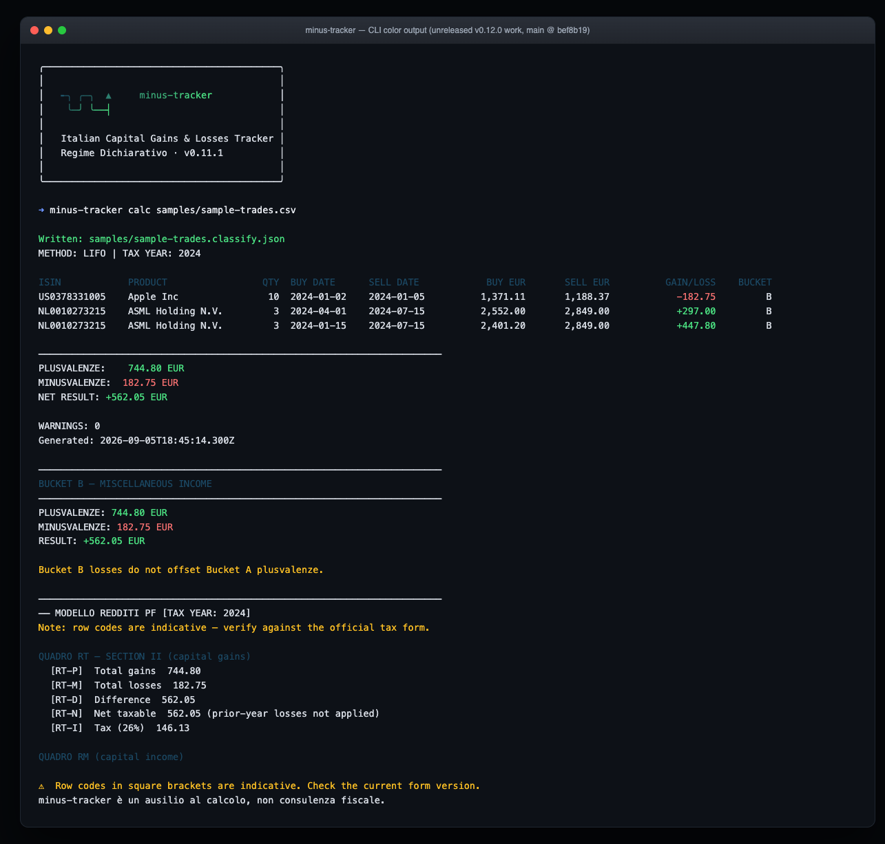

[← Back to README](../README.md) · [All docs](README.md)

# Quick Start

Don't have a DEGIRO export yet? Use the sample file bundled with the package.

**Via npx (no global install needed):**

```bash
curl -O https://raw.githubusercontent.com/gabrielerandelli/minus-tracker/main/samples/sample-trades.csv
npx @gabrielerandelli/minus-tracker calc sample-trades.csv
```

**If you have already installed the package locally:**

```bash
./node_modules/.bin/minus-tracker calc node_modules/@gabrielerandelli/minus-tracker/samples/sample-trades.csv
```

The file contains 5 fictional trades (Apple Inc in USD + ASML Holding in EUR) and
demonstrates partial LIFO matching, currency conversion, and a positive net result.

## Example Output

Running `calc` on the sample file produces:

```
METHOD: LIFO | TAX YEAR: 2024

ISIN            PRODUCT                 QTY  BUY DATE      SELL DATE            BUY EUR       SELL EUR          GAIN/LOSS
US0378331005    Apple Inc                10  2024-01-02    2024-01-05          1,371.11       1,188.37            -182.75
NL0010273215    ASML Holding N.V.         3  2024-04-01    2024-07-15          2,552.00       2,849.00            +297.00
NL0010273215    ASML Holding N.V.         3  2024-01-15    2024-07-15          2,401.20       2,849.00            +447.80

────────────────────────────────────────────────────────────────────────
PLUSVALENZE:    744.80 EUR
MINUSVALENZE:  182.75 EUR
NET RESULT: 562.05 EUR
```

In an interactive terminal, output is colorized (green for gains, red for losses, amber for
warnings):

<p align="center">
  
</p>

Add `--json` to get the raw `GainsReport` object — useful for programmatic integrations (see [Library Usage](library-usage.md)).

## Next steps

- [CSV Formats](csv-formats.md) — prepare your own export from DEGIRO or Interactive Brokers
- [CLI Usage](cli-usage.md) — full command reference

[← Back to README](../README.md) · [All docs](README.md)
